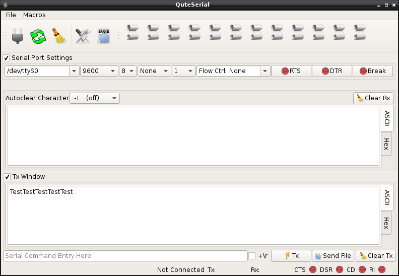
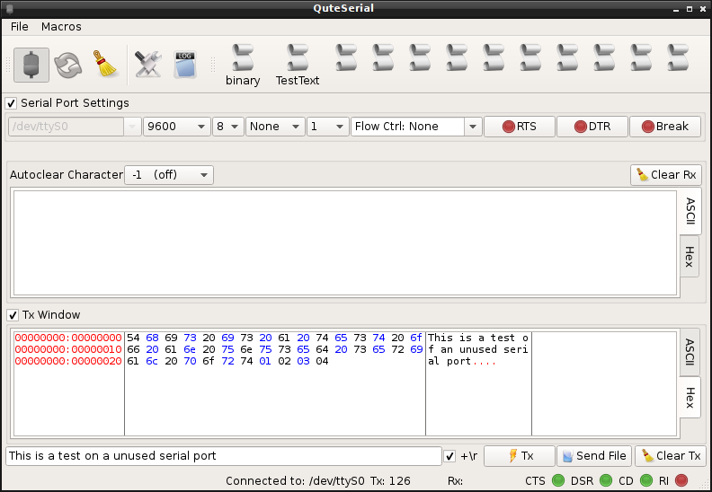
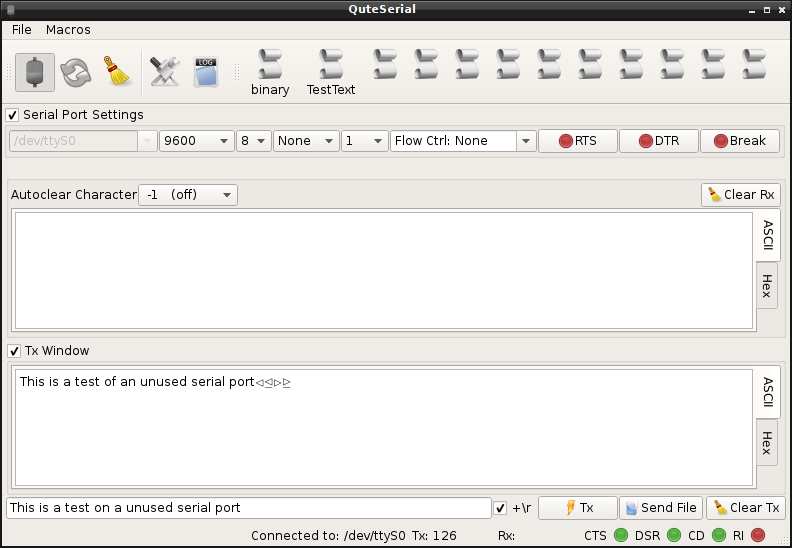

QuteSerial
==========

QuteSerial is a RS232 terminal in the veins of minicom, hyperterminal,
and br@y's Terminal.exe.  It allows you to access a old-fashioned RS232
(serial) port and display the received data in either a Hex or ASCII 
format. It also allows rudimentary macros to be configured so F1-F12
can send commonly used commands.

Screenshots
===========

We all know how much we like eye candy.

The main interface to QuteSerial

QuteSerial can display Tx and Rx data as either Hex or ASCII.  This is the Hex View

This is the standard ASCII

You can setup macros (in either escaped binary, or common escape sequences) that allow you to press F1-F11 to send them.  TODOs include the ability to remap these shortcuts

Requirements
=============

- Built on the Qt5 framework
  - QtSerialPort is core of serial IO
- Works on Windows and Linux (funtoo/gentoo).  Should work on OSX, but I dont have a OS X machine with RS232 ports

TODO
====

- Integrate a javascript interface
- Allow remapping of F1-F11 to whatever a user desires
- Configured to better work on Mac?
- Create icons

Building
========

- retrieve sources via `git clone git@github.com:npotts/QuteSerial.git`
- cd to QuteSerial and run `qmake`
- run `make` or `mingw32-make` if on windows
- output binary will be located in `bin/QuteSerial`

