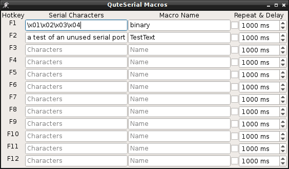

QuteSerial
==========

QuteSerial is a RS232 terminal in the veins of minicom, hyperterminal,
and br@y's Terminal.exe.  It allows you to access a old-fashioned RS232
(serial) port and display the received data in either a Hex or ASCII 
format. It also allows rudimentary macros to be configured so F1-F12
can send commonly used commands.

Screenshots
===========

We all know how much we like eye candy.

